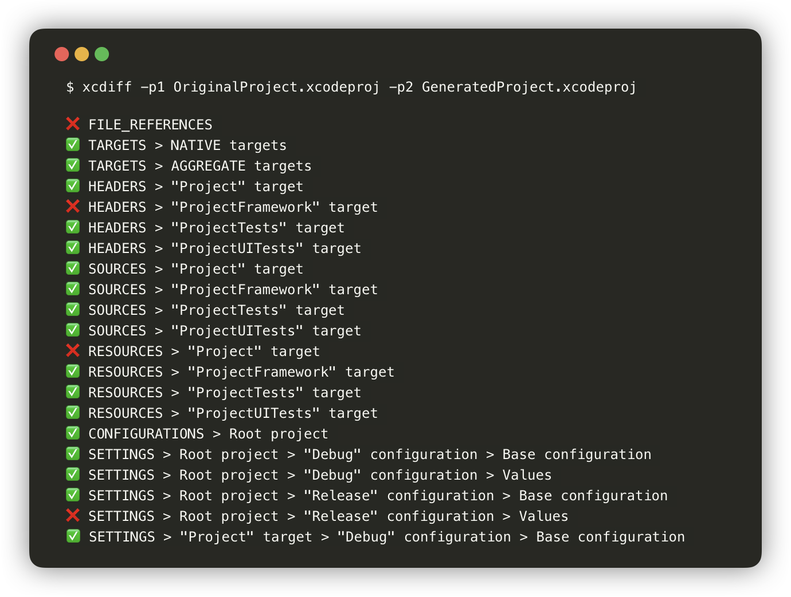
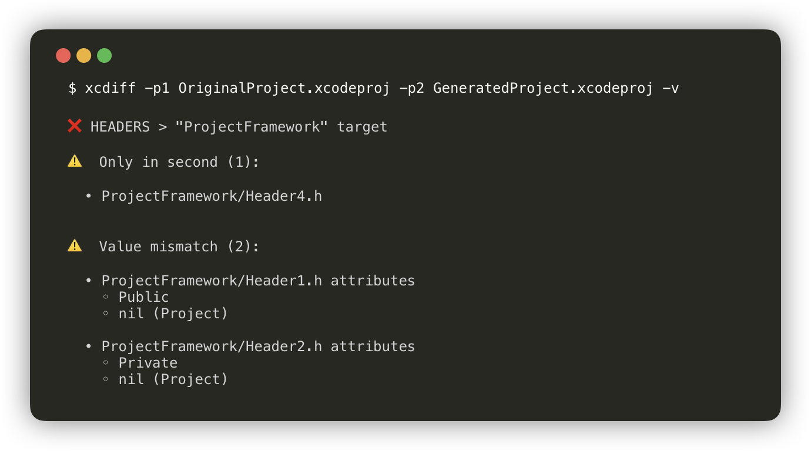

<p align="center">
   
</p>

[](https://github.com/bloomberg/xcdiff/actions/workflows/xcdiff.yaml)
[](https://codecov.io/gh/bloomberg/xcdiff)

*xcdiff* is an extensible tool that **finds differences between two .xcodeproj project files**. It can be thought of as git diff for .xcodeproj files, which can be used directly from the command line as well as a library supporting your own set of tools.

## How to use xcdiff

Running the command `xcdiff` in your project directory will search for two `.xcodeproj` files in this directory and use all of xcdiff's comparators on the projects (e.g. targets, sources and headers).

You can also specify two particular projects for xcdiff to compare.

```sh
xcdiff -p1 OriginalProject.xcodeproj -p2 GeneratedProject.xcodeproj
```

Here is an example output:

<p align="center">
   
</p>

To see a detailed report of differences you can specify the `--verbose` (`-v`) option.

```sh
xcdiff -p1 OriginalProject.xcodeproj -p2 GeneratedProject.xcodeproj -v
```

<p align="center">
   
</p>

## Use Cases

- When adopting project generation (e.g. using tools like [XcodeGen](https://github.com/yonaskolb/XcodeGen) or [Tuist](https://github.com/tuist/tuist)), comparing the generated xcodeproj files against the original ones can help boost confidence in the migration process.
- _Probably a few more we haven't thought of yet!..._

## Installation

- [Install xcdiff](Documentation/Installation.md#CLI) and use from the command line.
- [Add as a dependency](Documentation/Installation.md#Framework) of your macOS project (xcdiff follows the [semantic versioning][3]).

## Documentation

- Read [xcdiff CLI](Documentation/CLI.md) documentation or try `xcdiff --help`.
- Check out how to use [XCDiffCore Framework](Documentation/Framework.md) in your own project.

## Contributions

All improvements to xcdiff are very welcome!

If you see an issue that you would like to see fixed, the best way to make it happen is to help out by submitting a [Pull Request](../../pulls) implementing it. **Before sending a [Pull Request](../../pulls), please make sure you read our [Contribution Guidelines][2]**. Information in [Development Documentation](Documentation/Development.md) can help you to set up your local development environment.

We also welcome [Issue Reports](../../issues). Be sure to choose the proper issue template for your issue, so that all necessary details are provided.

## Attributions

We would like to thank the authors and contributors of the following projects:

- [XcodeProj](https://github.com/tuist/xcodeproj)
- [SwiftPM](https://github.com/apple/swift-package-manager) (Utility Library)

## Code of Conduct

This project has adopted a [Code of Conduct][1].
If you have any concerns about the Code, or behavior which you have experienced
in the project, please contact us at opensource@bloomberg.net.

## Security Vulnerability Reporting

If you believe you have identified a security vulnerability in this project,
please send email to the project team at opensource@bloomberg.net, detailing
the suspected issue and any methods you've found to reproduce it.

Please do NOT open an issue in the GitHub repository, as we'd prefer to keep
vulnerability reports private until we've had an opportunity to review and
address them.

## License

xcdiff is released under version 2.0 of the [Apache License](LICENSE.txt).


[1]: https://github.com/bloomberg/.github/blob/master/CODE_OF_CONDUCT.md
[2]: https://github.com/bloomberg/.github/blob/master/CONTRIBUTING.md
[3]: https://semver.org
